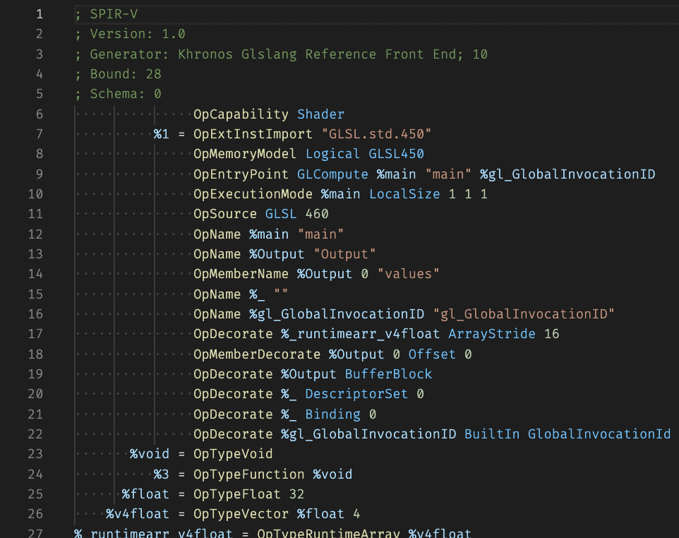

# SPIR-V Assembly Syntax Highlighting

This VSCode extension provides SPIR-V assembly syntax highlighting for Visual Studio Code. The SPIR-V assembly syntax is specified in [SPIRV-Tools](https://github.com/KhronosGroup/SPIRV-Tools/blob/master/docs/syntax.md).

**NOTE** `glslangValidator` doesn't emit SPIR-V assembly. You need `spirv-dis` to disassemble SPIR-V binaries (`*.spv`) to text.

## License

This project is licensed under either of

* Apache License, Version 2.0, ([LICENSE-APACHE](LICENSE-APACHE) or http://www.apache.org/licenses/LICENSE-2.0)
* MIT license ([LICENSE-MIT](LICENSE-MIT) or http://opensource.org/licenses/MIT)

at your option.
